# Sproutblade

A cheerful 3D action-platformer in the spirit of Zelda and Dragon Quest, built in **Godot 4.7.2**. You play a little sprout with a sword. You set out from the village of Mossbrook through the Rootway's arches into seven worlds. You collect Star Shards and Glimmer Seeds, and you learn a new magic ability each time you clear a world.

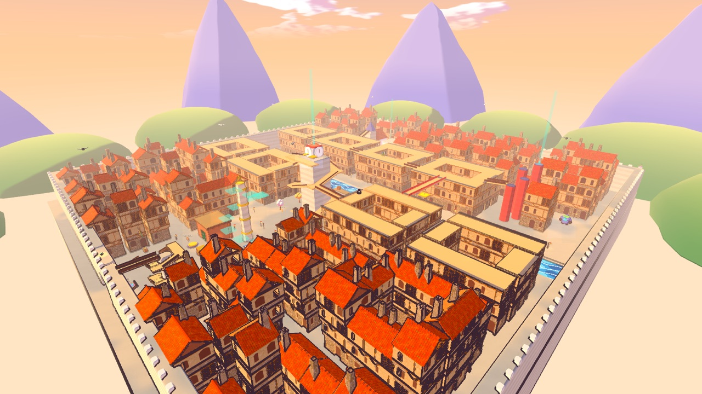

## The game

- **Small open worlds.** Every world is a sandbox you can tackle in any order. Each one has six Star Shards: three open its goal (a boss fight or a Grand Star), and the rest hide behind villagers' errands, secret rooms and puzzles.
- **A second world up high.** Every world has a large upper tier of its own: treetop villages, cloud kingdoms, rooftop towns and cliff ledges. You get up there by ladders, spiral ramps, lifts, bounce pads and wind.
- **Secrets and puzzles.** Every world has its own puzzles: mirrors and light beams, water levels, a turning bridge, braziers to light, colour locks, a critter to follow, a thunder dynamo, a villager's riddle, bloom-buds that open into steps. Breakable walls and bramble doors guard secret rooms, and villagers send you on errands.
- **Water you can swim in.** Lakes, rivers and pools are 8–12 m deep. They have grottos and seeds at the bottom, and you can use the sword while swimming.
- **A storybook look.** One toon shader is applied over CC0 models from Quaternius, KayKit and Kenney, with painted terrain, an ink outline and a bright palette.

### Mossbrook and the worlds

| | World | Goal | Up high |
|---|---|---|---|
| Hub | **Mossbrook**: a village on a lake island, round the Great Hollow Oak and the Rootway arches | | The Treetop Walk round the Oak |
| 1 | **Glimmerbrook Wilds**: forest meadows, a giant mushroom grove and Gloop Lake | Boss: Mother Gloop | Capstool Village in the mushroom canopy |
| 2 | **Cloudtop Steps**: floating islands, rainbow bridges and windmills | Grand Star | The Cloud Kingdom and its Sky Palace |
| 3 | **Sunscorch Canyon**: a winding painted-desert gorge | Boss: Rumble Golem | Mesa Town on the plateau, with walkable rooftops |
| 4 | **Bubbleton Reef**: an undersea town with Main Street, a walk-in grill and Pineapple Row | Grand Star | Coral Heights, terraces on top of coral towers |
| 5 | **Frostfang Peak**: a snowy valley with an ice slide, crystal caverns and pine heights | Boss: Avalanche Ape | The Rimwalk along the north cliffs |
| 6 | **Lanternwick**: a walled old-English riverside town of jettied timber houses, alleys and washing lines | Grand Star | The Sweep's Run rooftops, the Sky Bridge and the Clock Tower |
| 7 | **Planet Glorbo**: a candy-coloured alien moon, a crater round a lake of glowing goo, with dome villages and weird plants | Boss: Queen Bloomzilla | The Orbit Walk, a ring of floating decks, and the Crown Asteroid |

| | |
|---|---|
| 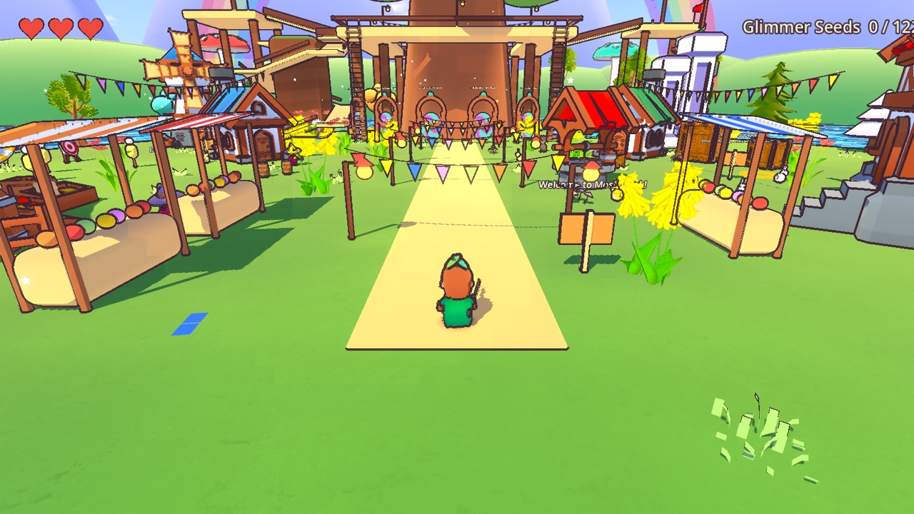 | 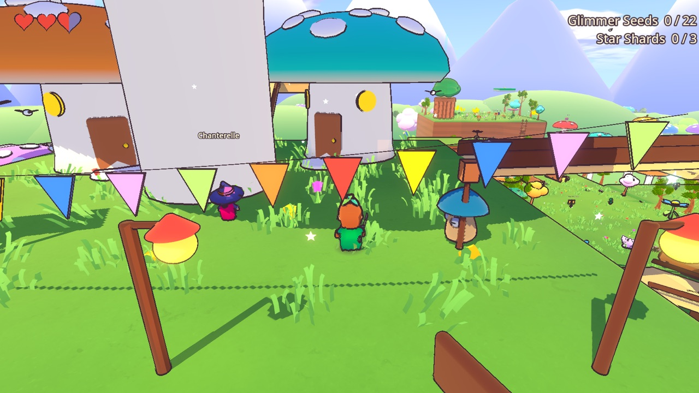 |
| Mossbrook | Glimmerbrook: Capstool Village |
| 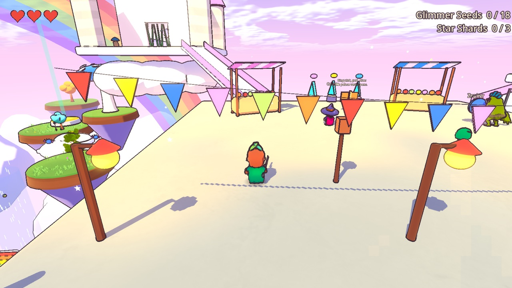 | 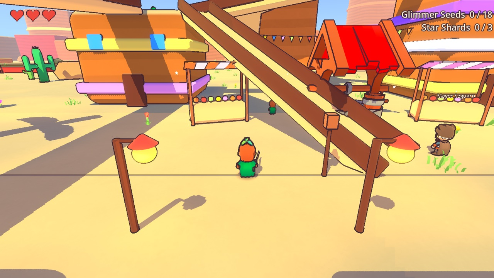 |
| Cloudtop: the Cloud Kingdom | Sunscorch: Mesa Town |
| 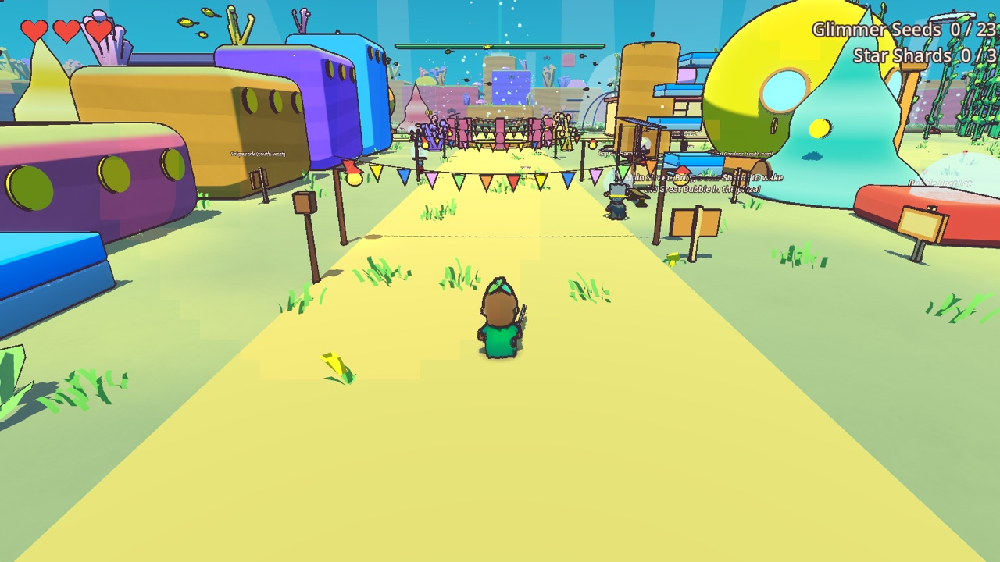 | 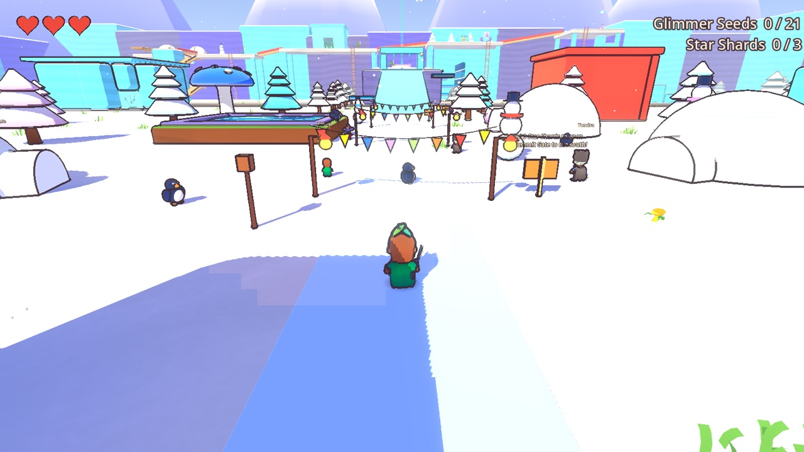 |
| Bubbleton Reef | Frostfang Peak |
| 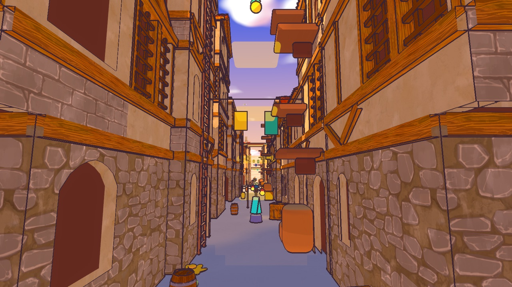 | 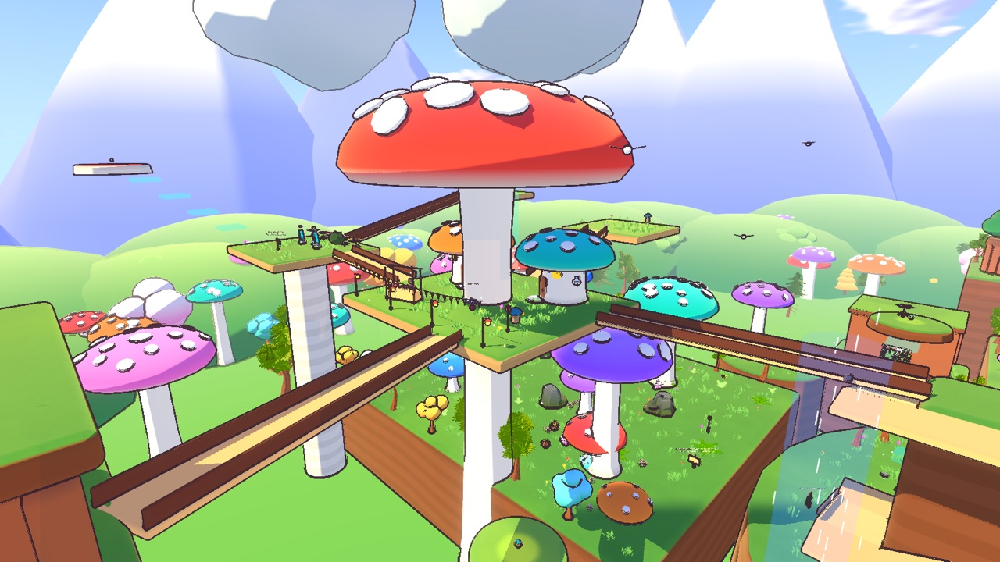 |
| A Lanternwick alley: a ladder, ledges and a crystal stair | The Glimmerbrook canopy from above |
| 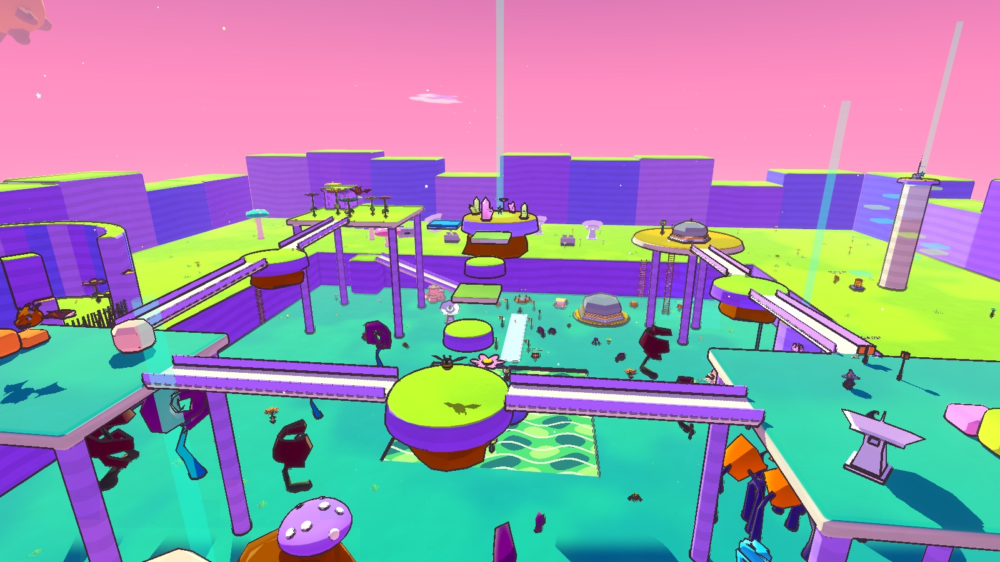 | 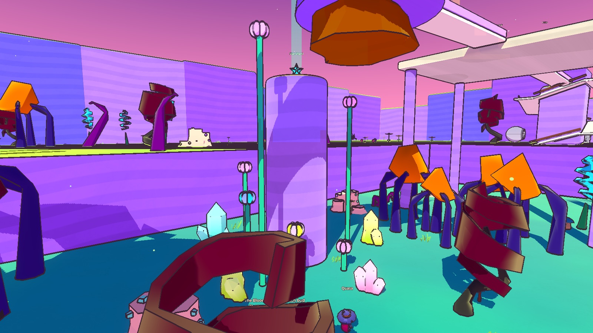 |
| Planet Glorbo and the Orbit Walk | The Bloomstalk: bop each bud to bloom the next step |

### Moves and magic

You have a triple jump, a downward Plunge (bounce off enemies and Springcaps), a sword combo that swings toward where the camera faces, wall slides and **wall jumps** (kick off a wall and keep whatever air jumps you had left; the same wall won't kick you twice in a row), climbable **ladders** and swimming. Pickups have a generous reach and drift to you when you're close.

Every world teaches a magic ability once it's finished with all six Star Shards in:

| Key | Ability | Learned from | Does |
|---|---|---|---|
| 1 / R | Fireball | Glimmerbrook | A ranged shot: lights torches, burns brambles, melts ice. |
| 2 / G | Vinelash | Cloudtop | Zip up to a glowing hook flower; with none near, lash a monster. |
| 3 / C | Thunderclap | Sunscorch | Hits every monster around you, even shielded ones. |
| 4 / V | Air Dash | Bubbleton | A quick dash, once per jump. |
| 5 | Frost Burst | Frostfang | Freezes monsters solid and water into floes you can stand on. |
| 6 | Spring Boots | Lanternwick | A huge spring onto rooftops (once more in the air). |
| 7 | Gravity Orb | Planet Glorbo | Drags monsters into a vortex, then pops. |
| 8 | Star Rush | World 8 | An untouchable sprint that bowls monsters over. |
| 9 | Mighty Roar | World 9 | Stuns every monster far around and knocks shields away. |

On a gamepad, pick an ability with D-pad left/right and cast it with RT (LB and RB stay Thunderclap and Air Dash).

### The Glimmer Seed shop

Clover runs Bramble & Bloom in Mossbrook. Spend the Glimmer Seeds you've found on sharper blades, extra hearts, a bigger Fireball, a longer Air Dash, a quicker Vinelash, a seed magnet, hats, and one bonus magic: **Seed Sense** (key 0 / L3), which points a beam at the nearest seed you haven't found.

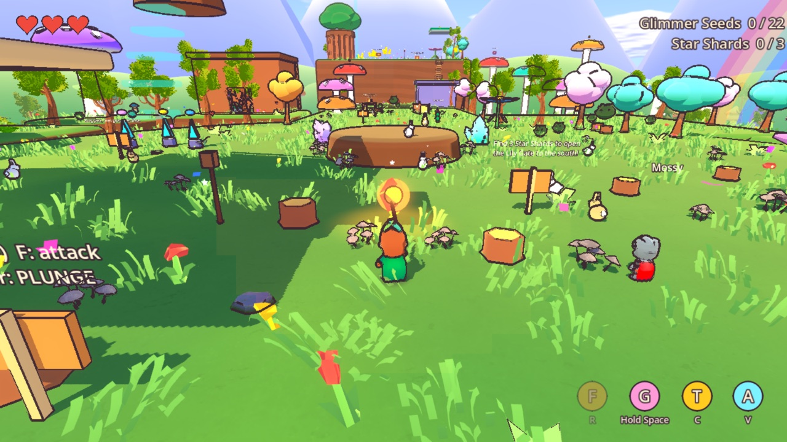

### Enemies

There are six basic monsters, and each one flashes before it attacks. Every ability is strong against at least two of them. See [docs/bestiary.md](docs/bestiary.md) for who beats what.

- **Gloplet and Big Gloplet:** the big one belly-flops onto you and splits into two Gloplets.
- **Batling and Snowbat:** swoop at you, and some hang under ledges.
- **Puffcap and Pricklepot:** spore lobs, a trampoline cap, a fan of needles.
- **Shieldknight:** charges and stuns itself on walls; Thunderclap knocks its shield away.
- **Mimic:** looks like a treasure chest, and can only be hurt while panting.
- **Boulderkin:** throws boulders and pounds the ground; the crystal on its back is the weak spot.

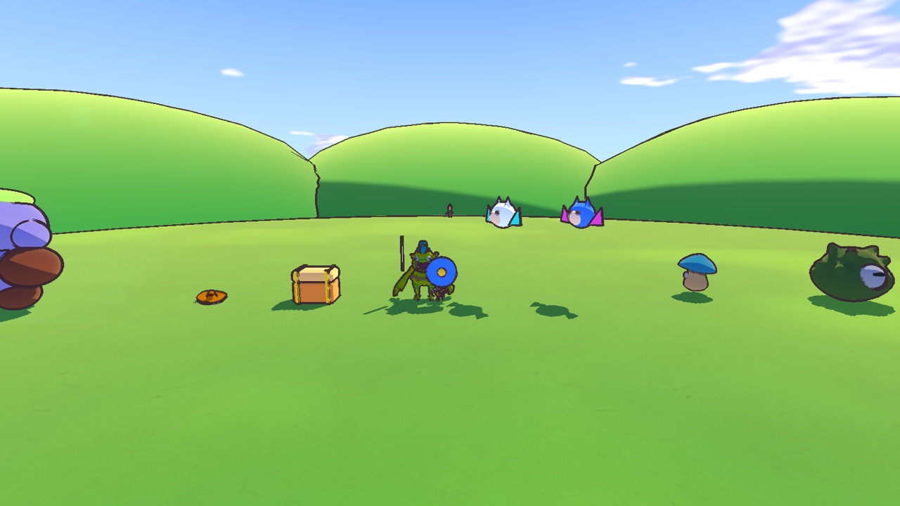

## Controls

| Action | Keyboard | Gamepad |
|---|---|---|
| Move / camera | WASD / arrow keys (swap them in Pause or under Controls on the title) | Left / right stick |
| Jump | Space | A |
| Attack | F or J | X |
| Plunge | Shift or K | B |
| Talk / interact | E | Y |
| Lock on / switch target | Q / Tab | LT / R3 |
| Magic (slots 1-9) | 1-9 (R, G, C, V shortcuts) | D-pad left/right to pick, RT to cast; LB, RB |
| Seed Sense (shop) | 0 | L3 |
| Camera zoom | + / − | D-pad up / down |
| Pause | Esc | Start |

Climb a ladder by walking into it, then use forward and back. Jump to let go. Developer keys: F1 opens the Feel Lab with live movement tuning, F2 shows AI debug and F3 unlocks every ability.

## Running it

You need [Godot 4.7.2](https://godotengine.org/) and macOS (Apple Silicon is the target). The Makefile expects Godot at `/Applications/Godot.app`; override it with `GODOT=/path/to/godot`.

```bash
make play    # play a snapshot of the last commit (safe while you keep editing)
make run     # run the working copy
make test    # every unit and simulation test, headless (fails on any FAIL line)
make import  # refresh Godot's import cache after adding a class_name
make capture SCENE=res://scenes/levels/w6/lanternwick.tscn   # screenshots from a scene's capture points
```

The tests drive the real movement loop in physics scenes. They cover movement, combat, swimming, wall jumps and ladders, every enemy, puzzles, every world's seeds, shards and spawns, the bosses, and save and resume.

## Art, sound and licences

The music is CC0 recordings by Komiku and Juhani Junkala: a tune for the title, Mossbrook, every world, the boss fights and Clover's shop. All sourced assets are CC0, and each one is listed with its source in [docs/assets/LICENSES.md](docs/assets/LICENSES.md). The unpacked packs live in `art/sourced/<pack>/`, and what the game uses is copied into `game/assets/`. Both are committed, so a fresh clone builds and plays as is.

The original download archives (several are over GitHub's 100 MB limit) are **not** in the repo. To fetch them again, for example to re-extract or update a pack:

```bash
make fetch-assets   # downloads the itch.io pack archives into art/sourced/_dl/ (git-ignored)
```

## Project layout

```
game/        the Godot project (scripts, scenes, data, shaders, assets, tests, tools)
art/         sourced packs, untouched, and the palette
audio/       synthesised sound and music sources
docs/        contracts, decisions, the board, the bestiary, licences and screenshots
tools/       helper scripts (palette, audio, asset fetching)
```
